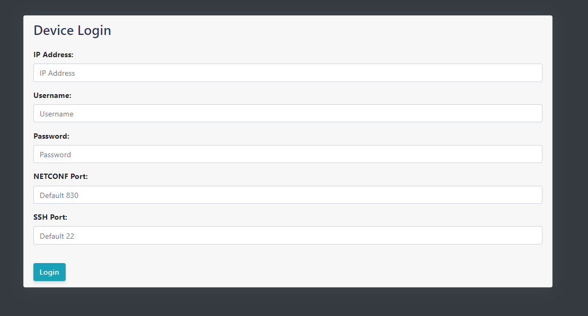
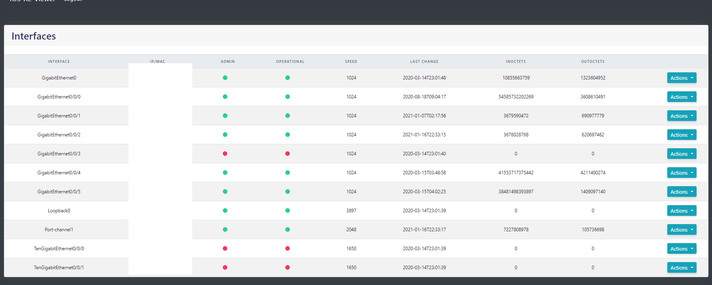
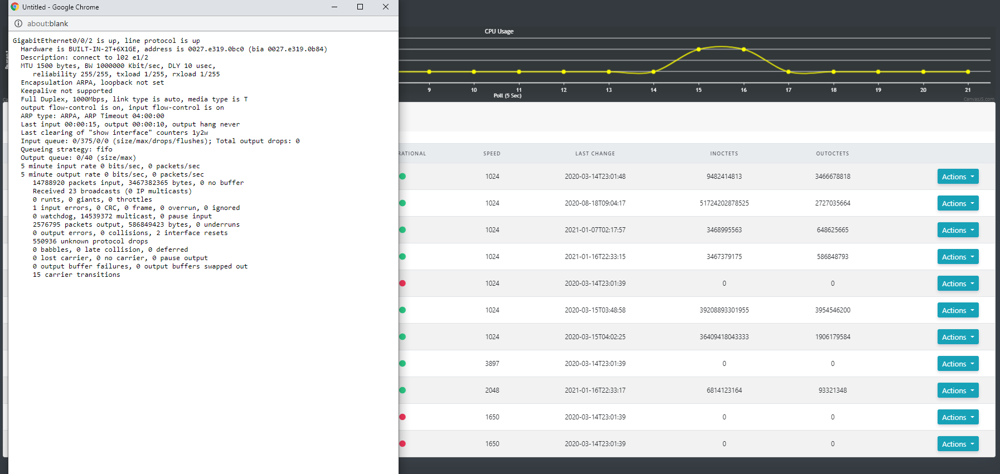
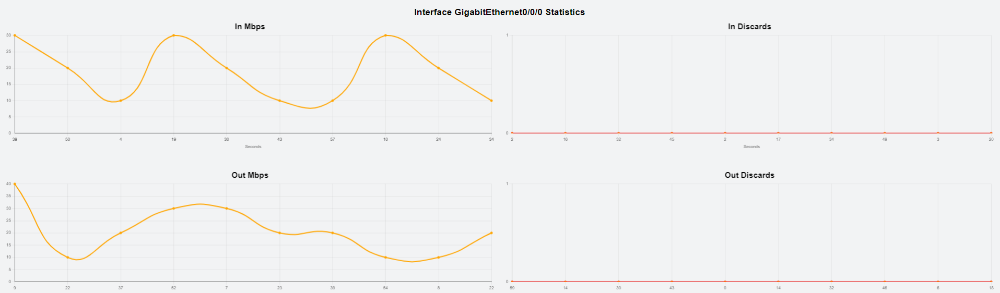
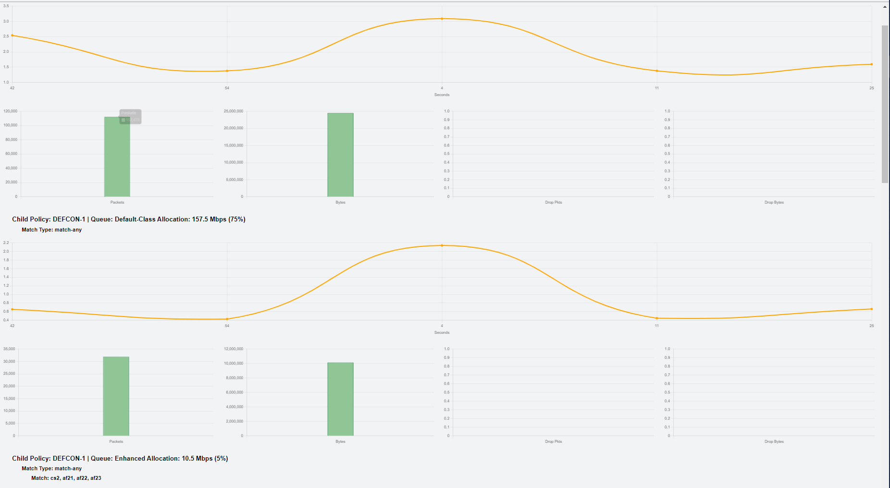

## CISCO IOS-XE Bandwidth Viewer

Bandwidth Viewer enables you to view bandwidth usage on devices as well as CPU usage for a device. It uses bot NETCONF-YANG and SNMP to collect data and Javascript to present data in live graph views.

YANG Model(s):
  - ietf-interfaces.yang
  - Cisco-IOS-XE-native.yang

### Login:
  - To launch app run "run.py" in the main directory
  - Use URL http://{**your_local_ip**}:5000/

### Index/Home Page:

Select dropdown action button for viewing interface bandwidth or interface details

### Live Charts

All data should reflect positive numbers. If a -1 is returned it means that there was a error in calculation

If graph shows '0' it means there wasn't a difference in packet in/out in the polling period (15 Seconds)

